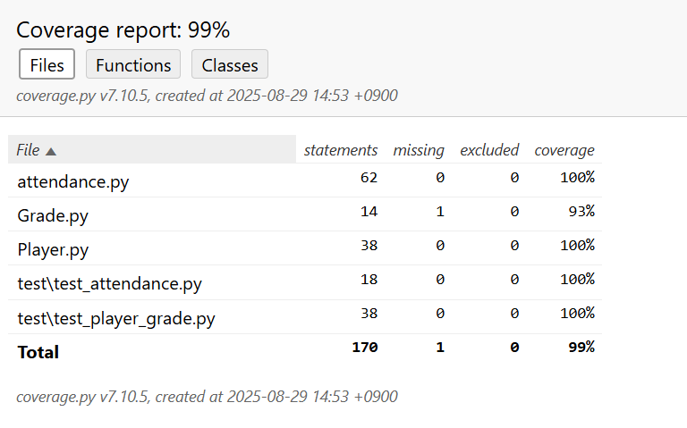
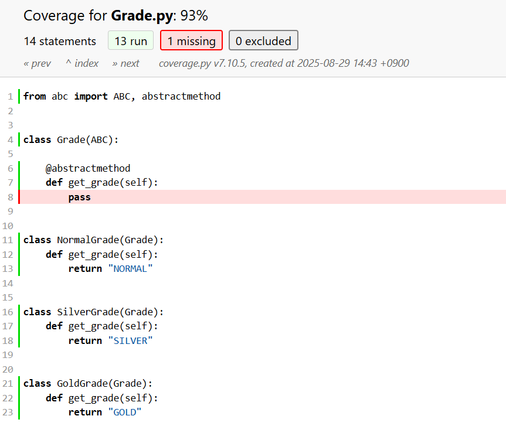

#### 공통과제

제출자: 김희준 (huijun.kim@samsung.com)

<table>
  <thead>
    <tr>
      <th colspan="2">요구사항 체크리스트</th>
    </tr>
  </thead>
  <tbody>
    <tr>
      <td>D1</td>
      <td>O</td>
    </tr>
    <tr>
      <td>D2</td>
      <td>X</td>
    </tr>
    <tr>
      <td>D3</td>
      <td>O</td>
    </tr>
    <tr>
      <td>D4</td>
      <td>O </td>
    </tr>
    <tr>
      <td>D5</td>
      <td>X</td>
    </tr>
  </tbody>
</table>

##### 참고사항: D4 Design Pattern
-> Factory Method Pattern
-> Singleton

##### Unit Test Capture

